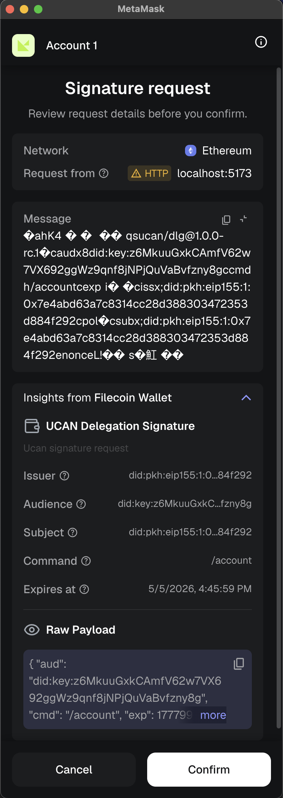

# eip191

Browser example showing how to use `iso-ucan` inside a web app with an
EIP-191 wallet signer.

The app is a small React/Vite application. It connects to an injected MetaMask
wallet with `wagmi`, installs the
[Filecoin Wallet Snap](https://github.com/filecoin-project/filsnap) with
`filsnap-adapter`, wraps the wallet provider in `EIP191Signer`, and uses that
signer to create and verify UCAN delegations and invocations directly in the
browser.

## What it demonstrates

- Creating a browser signer from an EIP-1193 wallet provider.
- Installing the
  [Filecoin Wallet MetaMask Snap](https://github.com/filecoin-project/filsnap)
  with `filsnap-adapter`.
- Defining UCAN capabilities with `iso-ucan/capability` and `zod` schemas.
- Delegating a capability from the connected wallet DID to an app agent.
- Storing proofs in an in-memory `iso-ucan` store.
- Building an invocation and verifying it with an EIP-191-aware resolver.

The demo capability is `/account`. Connecting a wallet calls
`getOrInstallSnap` from `filsnap-adapter`, which installs or enables the
[Filecoin Wallet Snap](https://github.com/filecoin-project/filsnap) for the
MetaMask provider. When **Delegate** asks MetaMask to sign the EIP-191 UCAN
payload, the snap adds a readable "UCAN Delegation Signature" insight panel to
the MetaMask signature popup, including the issuer, audience, subject, command,
expiration, and raw payload.



Pressing **Delegate** creates a delegation from the connected wallet to the
local app agent. Pressing **Invoke** builds an invocation that uses the stored
delegation as proof, then reconstructs it with `Invocation.from` to verify the
UCAN path in the browser.

## Layout

```
src/
├── main.tsx                         wagmi + React Query providers
├── app.tsx                          wallet connection flow
└── components/
    ├── wallet-options.tsx           injected wallet connector
    └── account.tsx                  iso-ucan delegation + invocation demo
```

## Running

Install dependencies from the repository root, then start the example:

```bash
pnpm install
pnpm --dir examples/eip191 dev
```

Open the Vite URL in a browser with an injected wallet provider, connect the
wallet, then use **Delegate** and **Invoke** to exercise the UCAN flow.

## Notes

This is a local development example. The app uses an in-memory proof store and a
hardcoded development agent key so the flow is easy to inspect. Production apps
should use their own key management, persistence, and audience configuration.
